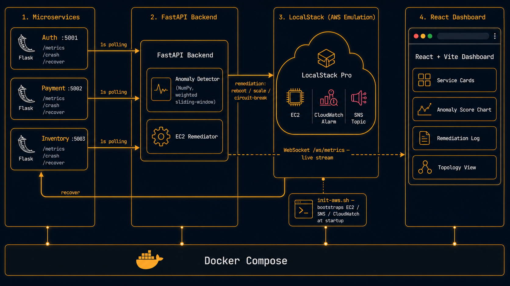

# HealGrid

<div align="center">


**A production-grade AIOps portfolio project where infrastructure heals itself. Anomalies are detected in real-time via a weighted sliding-window model, triggering EC2 API calls through LocalStack to reboot, circuit-break, or scale out affected services automatically.**

[Portfolio](https://harini-devops-portfolio.vercel.app) · [Report Bug](https://github.com/HariniMuruganantham/AiOps-Self-Healing-Infra/issues)

</div>

---

## 📋 Table of Contents

- [Overview](#-overview)
- [Architecture](#-architecture)
- [Tech Stack](#-tech-stack)
- [Features](#-features)
- [How Self-Healing Works](#-how-self-healing-works)
- [Project Structure](#-project-structure)
- [Getting Started](#-getting-started)
- [Environment Variables](#-environment-variables)
- [API Reference](#-api-reference)
- [LocalStack Integration](#-localstack-integration)
- [Author](#-author)

---

## 🧠 Overview

**HealGrid** monitors three real Flask microservices, detects anomalies using a weighted sliding-window model over live CPU, memory, latency, error rate, and health metrics, and automatically triggers remediation actions via LocalStack EC2 and service-level recovery endpoints.

All service health, anomaly scores, and remediation events stream to the React dashboard in real-time over WebSocket — no polling, no page refresh.

> **Why this project?** Most self-healing demos either fake the metrics or fake the healing. This one collects real psutil metrics from running containers, detects genuine degradation from injected crashes, and calls real LocalStack EC2 APIs to remediate — the full loop running locally with production-grade tooling.

---

## 🏗 Architecture



---

## 🛠 Tech Stack

| Layer | Technology |
|---|---|
| **Backend API** | FastAPI, Uvicorn, Python 3.12 |
| **Anomaly Detection** | NumPy weighted sliding-window (15-tick, exponential weights) |
| **Microservices** | Flask, psutil (auth, payment, inventory) |
| **Frontend** | React 18, Vite, Recharts, Nginx Alpine |
| **Cloud Emulation** | LocalStack Pro (EC2, CloudWatch, SNS) |
| **Streaming** | WebSocket — live metrics pushed every second |
| **Containerisation** | Docker, Docker Compose |
| **CI/CD** | GitHub Actions |

---

## ✨ Features

- **Real metric collection** — every service exposes live CPU %, memory %, latency, and error rate via psutil; backend polls all three every second
- **Weighted anomaly detection** — 5-feature sliding window (CPU, memory, error rate, response time, degradation score) with exponentially weighted recent ticks scored against a warmed-up baseline
- **Feature contribution scores** — dashboard shows which metric drove each anomaly flag (error rate spike vs latency vs CPU)
- **Three remediation strategies** — circuit break (POST /recover), scale out (EC2 simulation), reboot instance (real LocalStack EC2 API call)
- **Per-service cooldown** — 90-second cooldown per service after a heal event prevents remediation storms
- **Real-time WebSocket streaming** — metrics, anomaly score, feature breakdown, and heal events pushed to frontend every tick; no polling
- **Chaos controls** — crash and recover buttons per service directly in the dashboard
- **Remediation log** — timestamped log of every heal action with action type, service, EC2 call indicator, and result
- **Metric history endpoint** — last 120 ticks stored server-side for chart replay
- **LocalStack EC2 + SNS + CloudWatch** — EC2 instances registered at startup, CloudWatch alarms and SNS topic seeded via init script
- **Multi-stage Docker builds** — non-root users, HEALTHCHECK on every container

---

## 🔄 How Self-Healing Works

### Detection

The backend collects a 5-feature vector from all services every second:

```
[ avg_cpu, avg_memory, avg_error_rate, avg_response_time/10000, avg_degradation ]
```

Over 20 warm-up ticks it builds a baseline mean and standard deviation. Each subsequent tick gets z-score normalised against that baseline, passed through a 15-tick exponentially weighted window, and scored. Any score above the threshold (0.06) triggers anomaly detection.

### Remediation Decision

| Condition | Action |
|---|---|
| Error rate > 50% | Circuit break — POST /recover to the service |
| CPU > 85% | Scale out — simulated via EC2 API |
| Health < 30% | Reboot instance — real LocalStack EC2 `reboot_instances` call |

Each service has a 90-second cooldown after a heal to prevent repeated triggers.

---

## 📁 Project Structure

```
HealGrid/
├── backend/
│   ├── main.py               # FastAPI · AnomalyDetector · EC2Remediator · WebSocket stream
│   ├── requirements.txt
│   └── Dockerfile
├── frontend/
│   ├── src/
│   │   ├── App.jsx           # Dark dashboard · service cards · LSTM chart · feature scores · heal log
│   │   └── main.jsx
│   ├── nginx.conf            # WebSocket proxy pass for /ws/
│   ├── package.json
│   └── Dockerfile
├── services/
│   ├── auth/                 # Flask :5001 — /health /metrics /login /crash /recover
│   ├── payment/              # Flask :5002 — /health /metrics /charge /crash /recover
│   └── inventory/            # Flask :5003 — /health /metrics /stock /crash /recover
├── scripts/
│   └── init-aws.sh           # LocalStack bootstrap — EC2 instances, CloudWatch alarm, SNS topic, key pair
├── docs/
│   ├── Self-Healing-Arch.png
│   └── screenshots/
├── .env.example
├── .gitignore
└── docker-compose.yml
```

---

## 🚀 Getting Started

### Prerequisites

- [Docker Desktop](https://www.docker.com/products/docker-desktop/) (WSL2 backend on Windows)
- [LocalStack account](https://app.localstack.cloud) — free tier works

> No OpenAI key needed for this project. Detection is fully local using NumPy.

### 1. Clone the repository

```bash
git clone https://github.com/HariniMuruganantham/AiOps-Self-Healing-Infra.git
cd AiOps-Self-Healing-Infra
```

### 2. Set up environment variables

```bash
cp .env.example .env
```

Edit `.env`:

```env
LOCALSTACK_AUTH_TOKEN=ls-...
```

### 3. Start the stack

```bash
docker compose up --build
```

> Allow 3-5 minutes on first run for LocalStack Pro and all base images to pull.

### 4. Access services

| Service | URL |
|---|---|
| Frontend Dashboard | http://localhost:3002 |
| Backend API | http://localhost:8002 |
| LocalStack | http://localhost:4567 |
| LocalStack Console | https://app.localstack.cloud |
| Auth Service | http://localhost:5011 |
| Payment Service | http://localhost:5012 |
| Inventory Service | http://localhost:5013 |

### 5. Try it out

1. Open the dashboard at http://localhost:3002
2. Wait 20 seconds for the detector to warm up
3. Click **"Crash auth"** — watch the anomaly score spike
4. Watch the remediation log — circuit break or reboot fires automatically
5. Service recovers; score returns to baseline

### 6. Tear down

```bash
docker compose down -v
```

---

## 🔐 Environment Variables

| Variable | Description | Required |
|---|---|---|
| `LOCALSTACK_AUTH_TOKEN` | LocalStack Pro auth token | Yes |

---

## 📡 API Reference

| Method | Endpoint | Description |
|---|---|---|
| `GET` | `/health` | Backend health — version, trained state, registered instances |
| `GET` | `/status` | Full system snapshot — services, detector state, heal history |
| `GET` | `/services` | Live metrics from all 3 microservices |
| `GET` | `/metrics/history` | Last 120 ticks of metric snapshots |
| `GET` | `/topology` | Service dependency graph (nodes + edges) |
| `POST` | `/demo/crash/{service}` | Inject failure (degrades service for 60s) |
| `POST` | `/demo/recover/{service}` | Manually recover a degraded service |
| `GET` | `/aws/infra` | Full AWS overview — EC2, SNS, CloudWatch alarms |
| `GET` | `/aws/ec2` | EC2 instances from LocalStack |
| `WS` | `/ws/metrics` | Live WebSocket stream — metrics, scores, heal events |

---

## ☁️ LocalStack Integration

HealGrid uses LocalStack Pro to emulate AWS EC2, CloudWatch, and SNS locally. The `scripts/init-aws.sh` bootstrap script runs on container startup and:

- Creates a key pair (`aiops-key`)
- Launches 3 EC2 instances tagged by service name — registered by the backend at startup for EC2 API calls
- Creates an SNS topic (`aiops-alerts`) for alarm notifications
- Creates a CloudWatch alarm (`auth-svc-high-latency`) wired to the SNS topic

All resources are visible in the [LocalStack web console](https://app.localstack.cloud) under Resource Browser.

---

## 👩‍💻 Author

**Harini Muruganantham**
Junior DevOps Engineer · AIOps Enthusiast

[](https://harini-devops-portfolio.vercel.app)
[](https://github.com/HariniMuruganantham)
[](https://harini-devops.substack.com)

---

<div align="center">

⭐ If this project helped you, consider giving it a star!

</div>